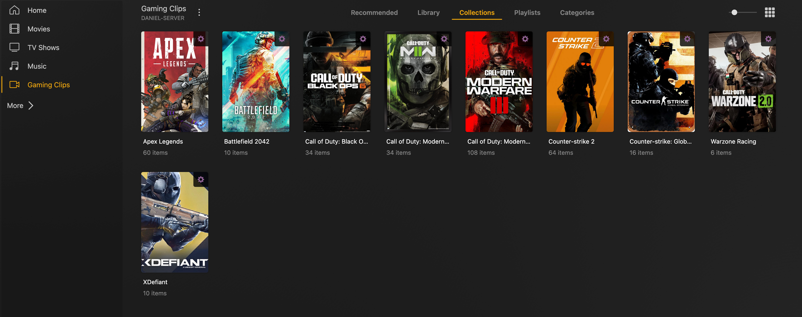
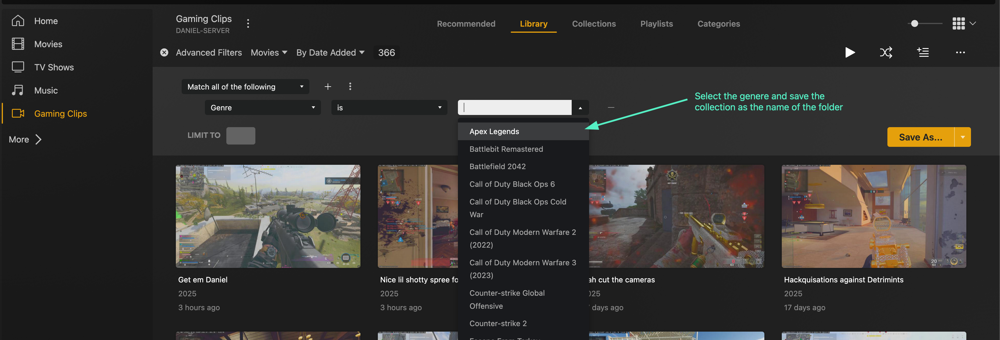

# Replay Tagger

A PowerShell script for automatically tagging game clips recorded with NVIDIA Instant Replay. The script adds the parent folder name as a genre tag to each video file, which enables Plex to automatically create dynamic collections per game.


*The end result: Your game clips automatically organized into collections by game name in Plex*

## Purpose

If you organize your game clips in folders by game name (e.g., a "Cyberpunk 2077" folder for all Cyberpunk clips), this script will:

1. Read the folder name for each video clip
2. Add that folder name to the genre metadata field
3. Allow Plex to automatically organize clips by game in collections

## Requirements

- PowerShell (Windows built-in, or PowerShell Core for macOS/Linux)
- FFmpeg installed on your system

## Setup

1. Download the script
2. Edit the following variables at the top of the script:
   - `$parentFolderPath`: Path to your game clips folder
   - `$defaultFfmpegPath`: Path to your ffmpeg.exe (if not in common locations)
3. Run the script

## How to Use

1. Make sure your clips are organized in folders by game name
   ```
   Game Clips/
   ├── Cyberpunk 2077/
   │   ├── clip1.mp4
   │   └── clip2.mp4
   ├── Elden Ring/
   │   ├── clip1.mp4
   │   └── clip2.mp4
   ```

2. Update the path in the script:
   ```powershell
   $parentFolderPath = "C:\Path\To\Your\Game Clips"
   ```

3. Run the script:
   ```powershell
   .\ReplayTagger.ps1
   ```

## Automating the Script

### Windows (Task Scheduler)

1. Open Task Scheduler (search for it in the Start menu)
2. Click "Create Basic Task" in the right panel
3. Enter a name (e.g., "Replay Tagger") and description
4. Set the trigger:
   - Daily/Weekly: For regular maintenance
   - On startup: If you want to process after every boot
   - On idle: To process when your computer isn't busy
   - Custom: For more advanced scheduling

5. For the action:
   - Select "Start a program"
   - Program/script: `powershell.exe`
   - Add arguments: `-ExecutionPolicy Bypass -File "C:\path\to\ReplayTagger.ps1"`

6. Review the settings and check "Open the Properties dialog when I click Finish"
7. Under the "General" tab, select "Run whether user is logged on or not"
8. Under "Conditions" tab:
   - Optionally check "Start the task only if the computer is idle for" if you want to avoid impacting performance
   - Consider checking "Start the task only if the computer is on AC power"

9. Click "OK" to save the task

### macOS (Launchd)

1. Create a plist file in `~/Library/LaunchAgents/` named `com.user.replaytagger.plist`:

```xml
<?xml version="1.0" encoding="UTF-8"?>
<!DOCTYPE plist PUBLIC "-//Apple//DTD PLIST 1.0//EN" "http://www.apple.com/DTDs/PropertyList-1.0.dtd">
<plist version="1.0">
<dict>
    <key>Label</key>
    <string>com.user.replaytagger</string>
    <key>ProgramArguments</key>
    <array>
        <string>pwsh</string>
        <string>-File</string>
        <string>/path/to/ReplayTagger.ps1</string>
    </array>
    <key>StartCalendarInterval</key>
    <dict>
        <key>Hour</key>
        <integer>23</integer>
        <key>Minute</key>
        <integer>00</integer>
    </dict>
</dict>
</plist>
```

2. Load the agent:
```bash
launchctl load ~/Library/LaunchAgents/com.user.replaytagger.plist
```

3. This will run the script daily at 11:00 PM

### Linux (Cron)

1. Open your crontab:
```bash
crontab -e
```

2. Add a line to run the script (e.g., daily at 11:00 PM):
```
0 23 * * * pwsh /path/to/ReplayTagger.ps1
```

3. Save and exit

## Setting Up Dynamic Collections in Plex

### Creating a Smart Collection for Each Game

1. Open Plex and navigate to your library containing game clips

2. Click on "Collections" in the left sidebar

3. Click the three-dot menu (⋮) in the top right of the screen

4. Select "Create Smart Collection" from the dropdown menu

5. In the "Rules" section:
   - Select "Genre" from the dropdown
   - Set it to "is" 
   - Enter the exact name of the game (matching the folder name)
   
   

6. Name your collection (typically the same as the game name)

7. Customize the collection with posters, artwork, etc.

8. Click "Save"

### Creating an Automatic Rule for All Games

For even more automation, you can set up Plex to automatically create collections for all genres:

1. Go to your library's settings

2. Click on the "Advanced" tab

3. Scroll down to "Collection Mode" and select "Hide items which are in collections"

4. Under "Automatically create collections", select "By genre" or "By genre and first letter"

5. Save changes

6. Plex will now automatically create a collection for each genre (which corresponds to each game folder name)

After setting this up, whenever you run the tagging script on new game clips, Plex will automatically add them to the appropriate game collection!

## Troubleshooting

- **FFmpeg Not Found**: The script checks common installation locations. If your ffmpeg is elsewhere, update the `$defaultFfmpegPath` variable.

- **No Collections in Plex**: 
  - Make sure the "Use local assets" option is enabled in your Plex library settings
  - Verify that the genre tags were properly applied using a media info tool
  - Refresh your Plex library and wait for metadata processing to complete

- **Script Not Running on Schedule**:
  - Check your system's task scheduler logs
  - Ensure the paths in your task configuration are absolute paths
  - Verify that the account running the task has access to the folders

## How It Works

The script:
1. Scans your specified directory for video files
2. Checks if each file already has a genre tag
3. For files without a genre tag, it adds the parent folder name as the genre
4. Preserves the original file timestamps
5. Creates temporary files during processing to ensure data integrity

This allows Plex to automatically create collections based on the genre metadata, giving you a neatly organized game clip library.

## Contributing

Contributions are welcome! Please see [CONTRIBUTING.md](CONTRIBUTING.md) for guidelines on how to contribute to this project.

When reporting issues or requesting features, please use the provided issue templates:
- For bugs: Use the Bug Report template
- For feature ideas: Use the Feature Request template

These templates will help ensure you provide all the necessary information.

## License

This project is licensed under the MIT License - see the [LICENSE](LICENSE) file for details.